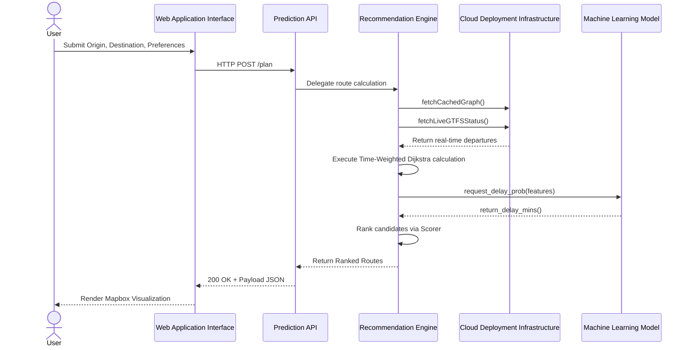
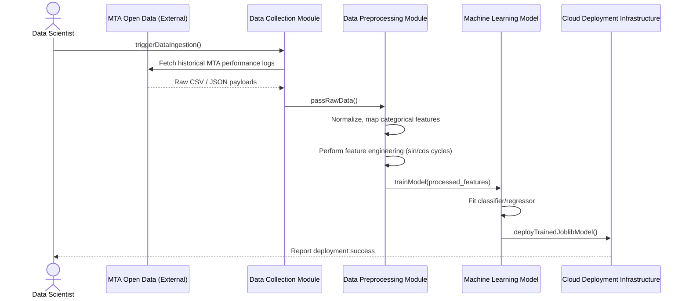
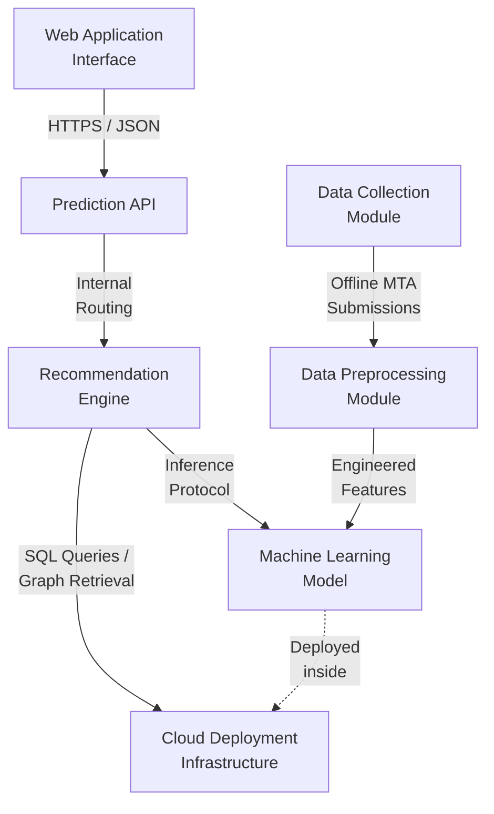
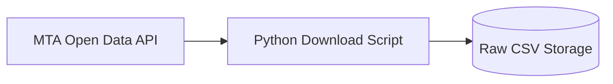
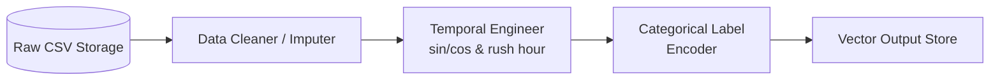
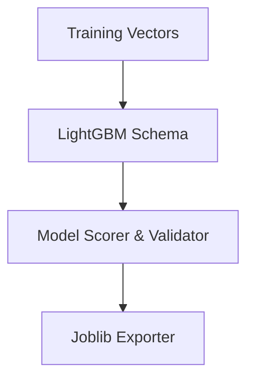
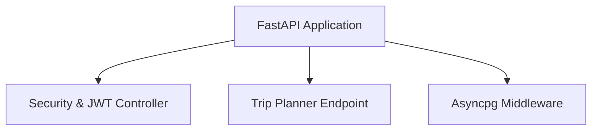
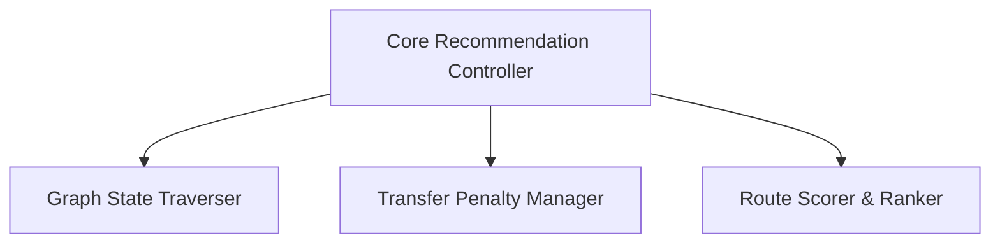
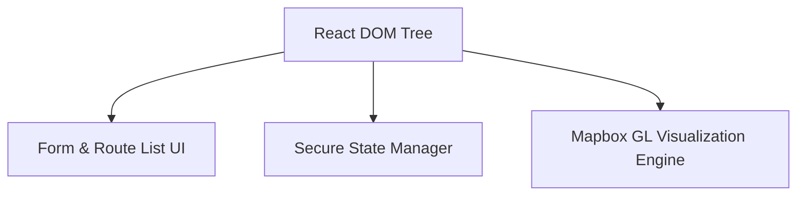
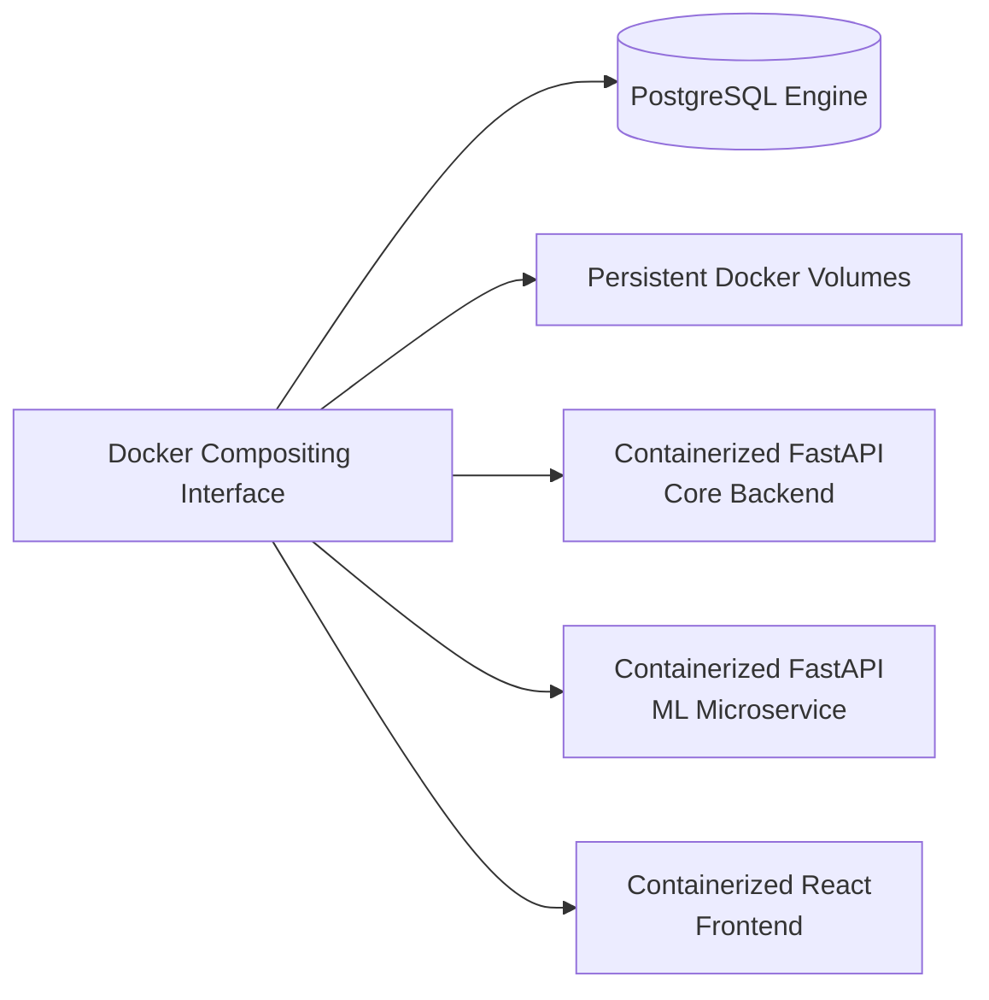

# 10. SYSTEM-WIDE DESIGN DECISIONS

*Note: As per section requirements, ensure that all Functional Requirements (Use Case, Use Case Diagrams), Non-Functional Requirements, and Domain Requirements have been updated prior to formalizing this section.*

## Process Architecture Diagrams

Because the OnTime system consists of both real-time user serving and asynchronous model training, the process architecture is divided into two distinct sequence diagrams to encompass all seven core components.

### 1. Live Trip Routing (User Interaction)
The primary system function: generating an optimized, ML-scored subway route for commutters.

### 2. Offline Model Training (Data Pipeline)
The asynchronous backend process where data science operations prepare the logic used by the ML service. 

---

## 10.1 Software Component Architectural Design

Using the updated set of Functional Requirements, Non-Functional Requirements, and Domain Requirements, the OnTime system decomposes into seven strict sub-components.

### 10.1.1 System Component Relationships (Overview)
*This diagram illustrates how the seven primary components interface and relate to one another within the system boundary.*

### 10.1.2 Individual Component Architecture

**1. Data Collection Module**

**2. Data Preprocessing Module**

**3. Machine Learning Model**

**4. Prediction API**

**5. Recommendation Engine**

**6. Web Application Interface**

**7. Cloud Deployment Infrastructure**

---

## 10.2 Software Architecture General Description

**Decoupled Microservice and Pipeline Architecture**
The OnTime architecture is fundamentally divided into two operational scopes: a synchronous, real-time microservice cluster (handling user routing) and an asynchronous, offline data pipeline (handling model training).

**Rationale for Component Decomposition:**
1. **Offline vs. Online Processing (Data Modules vs. Live ML):** The *Data Collection Module* and *Data Preprocessing Module* are explicitly separated from the live system. Feature engineering on massive MTA datasets and fitting a LightGBM model are computationally expensive tasks. Isolating these as offline modules ensures the live *Machine Learning Model* only has to load static `.joblib` files, guaranteeing sub-second inference times for end users.
2. **Memory & Compute Isolation (ML Model vs. Prediction API):** The *Prediction API* operates on I/O-bound processes (database queries, async network requests to MTA feeds), benefiting from high-concurrency event loops. In contrast, the *Machine Learning Model* executes CPU-bound mathematical operations using Scikit-Learn. Decomposing them guarantees that CPU-heavy ML predictions do not block the concurrent network thread pool, allowing both to scale horizontally at different rates.
3. **Business Logic Separation (Recommendation Engine vs. API):** The *Recommendation Engine* encapsulates the complex Time-Weighted Dijkstra graph traversal and transfer penalty mathematics. By separating this from the *Prediction API*, the API acts strictly as a gateway (handling auth, JSON validation, and HTTP routing) while the Engine remains a pure logical module.
4. **Decoupled User Experience (Web Application Interface):** By serving the *Web Application Interface* independently via React, it allows the client browser to handle computationally heavy Mapbox GL vector graphics, offloading spatial rendering entirely from the backend servers.
5. **Environment Abstraction (Cloud Deployment Infrastructure):** Treating the *Cloud Deployment Infrastructure* as a separate component enforces the "Separation of Concerns" principle. It isolates container networking (Docker), database persistence (PostgreSQL), and reverse-proxy logic from the actual Python application code, ensuring the software can be redeployed across any cloud provider.

---

## 10.3 Software Item Components

**Web Application Interface**
The frontend component captures user queries (locational data, preferred lines) and displays a responsive user interface. It leverages a localized Mapbox GL instance to project graph nodes and visual routing paths onto spatial map layers natively in the browser, rendering dynamic itineraries.

**Prediction API**
This component acts as the central API Gateway. It exposes the overarching REST endpoints (such as `/plan` and `/users`), validates incoming internet traffic using Pydantic schemas, and manages secure asynchronous database sessions using `asyncpg`. It also handles security and authentication by validating JWT bearer tokens for protected routes.

**Recommendation Engine**
The Recommendation Engine houses the core business logic. It computes the mathematical shortest path using a custom Time-Weighted Dijkstra algorithm, integrating literal pedestrian traverse durations and inter-station transfer penalties. It also dynamically queries external live feeds to replace static historical schedule waits with precise departures.

**Machine Learning Model**
Operating as an isolated service, this component accepts formatted telemetry (cyclical hour, rush hour mapping, stops) from the Recommendation Engine. It executes an inference tree on a static LightGBM model to anticipate system-wide subway delays in seconds, returning predictive weights to influence routing logic.

**Data Collection Module** 
An offline pipeline component responsible for systematically downloading historical MTA performance logs and transit telemetry. This module bridges the gap between external MTA open data systems and the application's internal raw storage repositories.

**Data Preprocessing Module**
A robust offline processing engine that sanitizes raw CSV data. It converts timestamps into cyclical trigonometric features, flags temporal categories like rush hours, and encodes string labels into numeric arrays. The output is a highly optimized vector store ready for model ingestion.

**Cloud Deployment Infrastructure**
This infrastructure layer manages the isolated Docker containers orchestrating the application. It provides the isolated environment for the PostgreSQL database engine to persist user data, network bridges for microservice communication, and persistent volumes for storing the deployment-ready ML models.

---

## 10.4 Component Interface Identification

Note: Interface IDs establish authoritative boundaries between the architecture's decoupled services.

Interface IF-01 is the SubmitRouteQuery. It sends validated origin and destination coordinates, along with user-defined constraints such as preferred target line and max walking distance. This interface connects the Web Application Interface to the Prediction API.

Interface IF-02 is the RequestDelayInference. It sends raw localized features asynchronously via an internal Docker network HTTP POST request. It awaits a prediction response matching the expected delay impact. This interface connects the Recommendation Engine to the Machine Learning Model.

Interface IF-03 is the QueryLiveFeeds. It pulls aggregated protocol buffer files directly from the MTA server endpoint arrays, translating encoded data into application dictionaries. This interface connects the Recommendation Engine to the external MTA API system.

Interface IF-04 is the PersistStateInteraction. It dispatches asynchronous SQL transactions to append or query user data. This interface bridges the Prediction API and the Cloud Deployment Infrastructure, specifically the PostgreSQL database layer.

---

## 10.5 Software Component Concept of Execution

The Web Application Interface execution is triggered when a user interacts with the browser application to submit origin coordinates, destination coordinates, and route preferences. The expected outcome is that the component captures this input, dispatches a network request to the backend, and subsequently renders the returned routing data onto a visual Mapbox projection.

The Prediction API execution begins when an external HTTP request arrives from the frontend client. The component validates the incoming JSON payload against stringent Pydantic schemas. Its expected outcome is the successful routing of the event to internal logic controllers and the return of a standardized HTTP status response encapsulating the requested data.

The Recommendation Engine component is triggered upon receiving instructions from the Prediction API to calculate an optimal transit path. The expected outcome is that it traverses the subway graph using a Time-Weighted Dijkstra algorithm, requests predictive delay penalties, integrates live feed wait times, and returns a fully ranked list of itinerary candidates.

The Machine Learning Model execution is invoked asynchronously via an internal HTTP callback from the Recommendation Engine carrying feature dictionaries. The expected outcome is that the component processes cyclical time identifiers, executes an inference operation against a static LightGBM model, and returns the expected delay in seconds for the requested train line.

The Data Collection Module execution is initiated manually by an administrator or on a cron schedule to update offline metrics. The expected outcome is the successful connection to external MTA open data endpoints, resulting in the download and storage of raw transit performance CSV files into the local dataset repository.

The Data Preprocessing Module is triggered offline to process the raw datasets gathered by the collection module. The expected outcome is the sanitization of historical data, generation of trigonometric time features, and encoding of categorical string labels into a finalized vector format suitable for model training.

The Cloud Deployment Infrastructure execution begins at the server initialization phase when the Docker Compose interface is launched. The expected outcome is the successful orchestration of all network bridges, the mounting of persistent database volumes, and the continuous background hosting of the PostgreSQL engine and containerized microservices.
