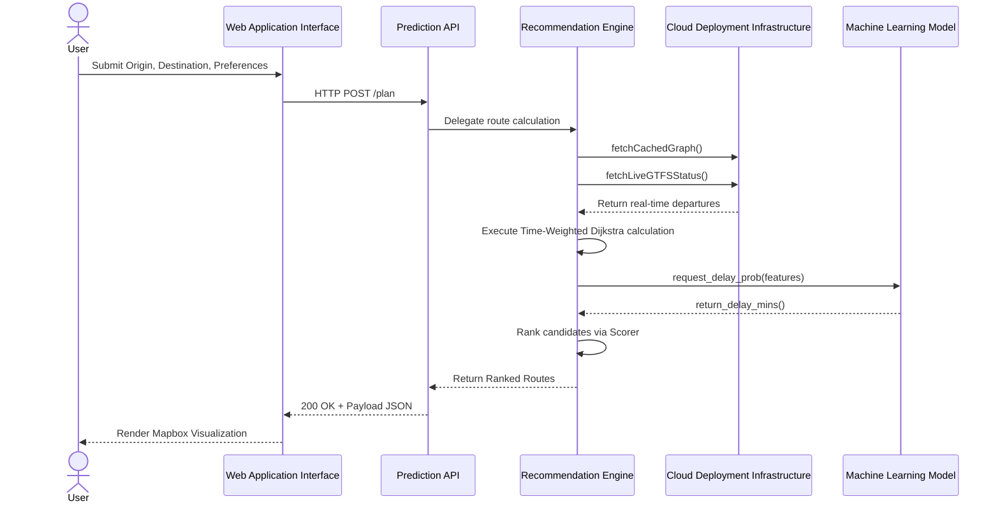
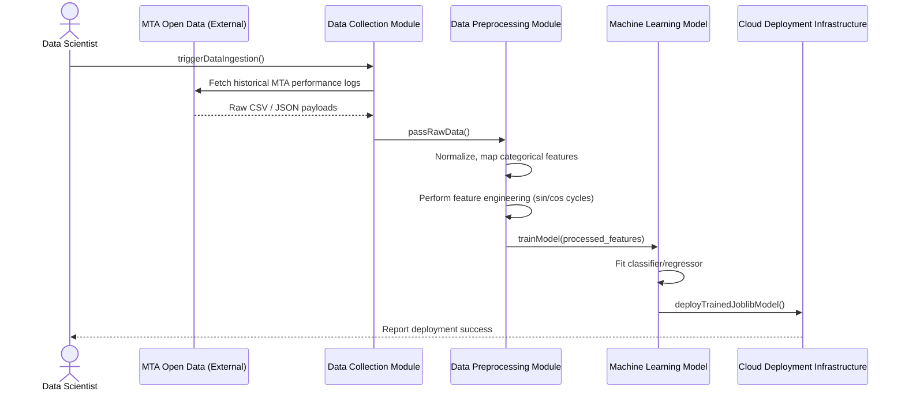
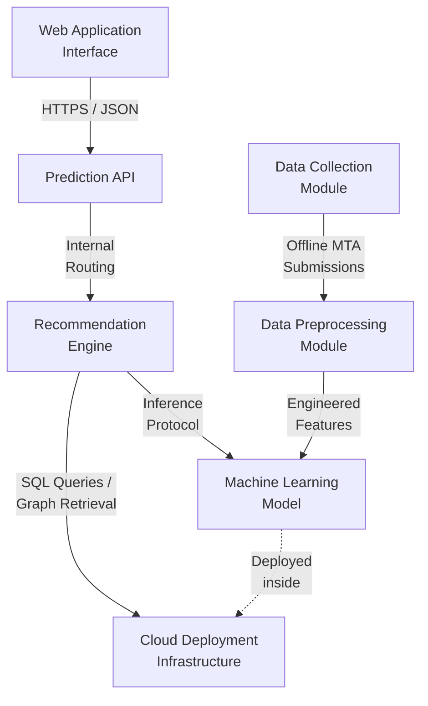
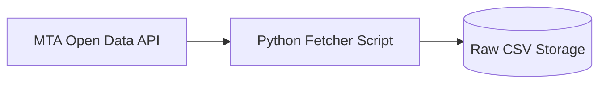
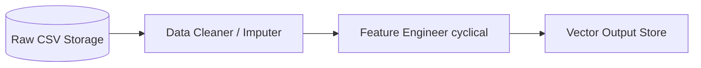
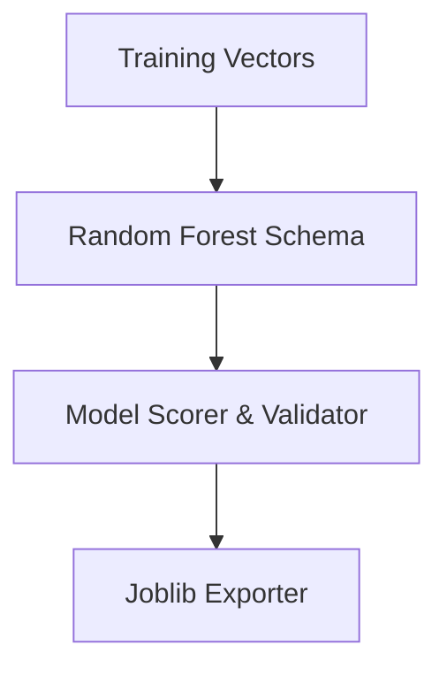
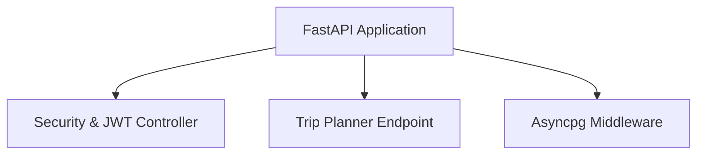
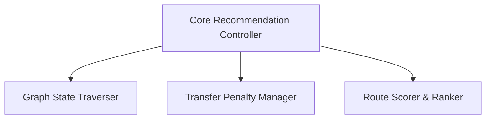
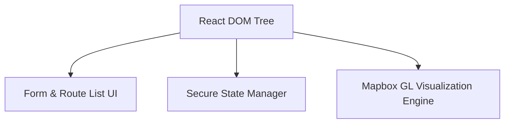
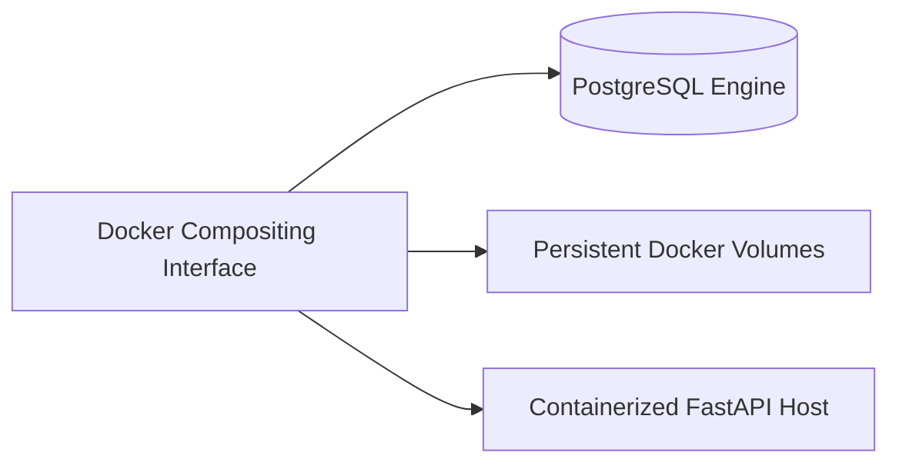

# 10. SYSTEM-WIDE DESIGN DECISIONS

*Note: As per section requirements, ensure that all Functional Requirements (Use Case, Use Case Diagrams), Non-Functional Requirements, and Domain Requirements have been updated prior to formalizing this section.*

## Process Architecture Diagrams

Because the OnTime system consists of both real-time user serving and asynchronous model training, the process architecture is divided into two distinct sequence diagrams to encompass all seven core components.

### 1. Live Trip Routing (User Interaction)
The primary system function: generating an optimized, ML-scored subway route for commutters.

### 2. Offline Model Training (Data Pipeline)
The asynchronous backend process where data science operations prepare the logic used by the ML service. 

---

## 10.1 Software Component Architectural Design

Using the updated set of Functional Requirements, Non-Functional Requirements, and Domain Requirements, the OnTime system decomposes into seven strict sub-components.

### 10.1.1 System Component Relationships (Overview)
*This diagram illustrates how the seven primary components interface and relate to one another within the system boundary.*

### 10.1.2 Individual Component Architecture

**1. Data Collection Module**

**2. Data Preprocessing Module**

**3. Machine Learning Model**

**4. Prediction API**

**5. Recommendation Engine**

**6. Web Application Interface**

**7. Cloud Deployment Infrastructure**

---

## 10.2 Software Architecture General Description

**Decoupled Microservice Architecture**
The architecture is divided into three primary deployable artifacts: the React SPA Frontend, the Core FastAPI Backend, and the Machine Learning FastAPI Microservice. 

**Rationale for Decomposition:**
1. **Memory & Compute Isolation:** The core application operates on I/O-bound processes (database queries, network requests to MTA GTFS feeds), benefiting from asynchronous event loops. In contrast, the `ML Delay Prediction Service` needs to hold bulky static `joblib` models (e.g., Random Forest) and Scikit-Learn transformers in memory. Running them independently guarantees that CPU-heavy ML predictions do not block the concurrent network thread pool.
2. **Horizontal Scalability:** The delay prediction engine can scale independently of the web-serving API gateway under heavy network load traffic.
3. **Decoupled Frontend:** By serving the frontend via Vite/React independently, it can be hosted on a global CDN edge layer perfectly distinct from backend application processing.

---

## 10.3 Software Item Components

| Component | Functionality |
| :--- | :--- |
| **Frontend User Interface** | Captures user queries (locational data, preferred lines), displays the responsive Mapbox interface, and renders ranked dynamic itineraries. |
| **Map Engine Component** | A localized instance wrapping Mapbox GL to project graph nodes and visual routing paths onto spatial map layers natively in the browser. |
| **API Gateway / API Router** | Exposes the overarching REST API endpoints (`/plan`, `/live`, routes for users/auth). Funnels external internet traffic to specific backend sub-components and normalizes inputs using Pydantic models. |
| **Security & Authentication** | Validates user identity using JWT bearer tokens. Enforces access controls for submitting user reviews or persisting favorite routes. |
| **Subway Routing Engine** | Computes the mathematical shortest path using a custom Time-Weighted Dijkstra algorithm, integrating literal pedestrian traverse durations and inter-station transfer penalties. |
| **GTFS Live Feed Integrator** | Connects dynamically to the MTA real-time GTFS feeds to replace static historical schedule waits with precise, live subway departures. |
| **ML Delay Prediction Service** | Accepts formatted telemetry (date, cyclical hour, rush hour mapping, stops) and executes an inference tree to anticipate system-wide subway delays in seconds. |
| **Database Session Manager** | Creates, pools, and gracefully terminates asynchronous `asyncpg` connections mapped to PostgreSQL schemas ensuring safe concurrency states. |

---

## 10.4 Component Interface Identification

*Note: Interface IDs establish authoritative boundaries between the architecture's decoupled services.*

- **ID:** `IF-01`
- **Name:** `SubmitRouteQuery`
- **Description:** Sends validated origin/destination coordinates and user-defined constraints (preferred target line, max walking) securely over HTTPS via JSON payload.
- **Component 1:** Frontend User Interface
- **Component 2:** API Gateway / API Router

- **ID:** `IF-02`
- **Name:** `RequestDelayInference`
- **Description:** Sends raw localized features asynchronously via internal Docker network HTTP POST; awaits a scalar prediction response matching the expected delay impact.
- **Component 1:** Subway Routing Engine
- **Component 2:** ML Delay Prediction Service

- **ID:** `IF-03`
- **Name:** `QueryLiveFeeds`
- **Description:** Pulls aggregated protocol buffer files directly from the MTA server endpoint arrays, translating standard encoded GTFS data into workable application dictionaries.
- **Component 1:** GTFS Live Feed Integrator
- **Component 2:** External System (MTA API)

- **ID:** `IF-04`
- **Name:** `PersistStateInteraction`
- **Description:** Dispatches asynchronous SQL transactions to append or query favorite endpoints and user profile payloads.
- **Component 1:** Database Session Manager
- **Component 2:** Persistence Layer (PostgreSQL)

---

## 10.5 Software Component Concept of Execution

### API Gateway
- **Motive / Event:** The user initiates an HTTP request directly to the server to establish an authenticated session or query for a transit route.
- **Expected Outcome:** Validates the schema via Pydantic; routes the event to corresponding logic controllers and safely guarantees an HTTP 2xx or 4xx status response JSON is serialized and returned.

### Subway Routing Engine
- **Motive / Event:** Received instructions from the API Gateway to fulfill a `/plan` POST constraint set containing coordinate matrices.
- **Expected Outcome:** Iterates algorithmically through valid graph paths, pings the live feed and ML service for penalizations, and guarantees the return of a ranked JSON blob containing travel times, walking distances, and ordered routing lists.

### ML Delay Prediction Service
- **Motive / Event:** Awakens solely upon receiving a local HTTP callback trigger (`/predict`) from the backend architecture carrying standardized dictionary properties.
- **Expected Outcome:** Parses the cyclic time identifiers through Scikit-Learn transformers, executes the `.predict()` wrapper on the static Random Forest schema, and returns normalized seconds of expected delay stringently mapped to the requested train line.

### GTFS Live Feed Integrator
- **Motive / Event:** Executed continuously as requested by the Routing Engine or asynchronously via the `/live` public API gateway ping.
- **Expected Outcome:** Retrieves up-to-date protocol buffers, successfully extracting next-station wait times without thread blockage. Returns integer values representing immediate seconds-until-arrival.
