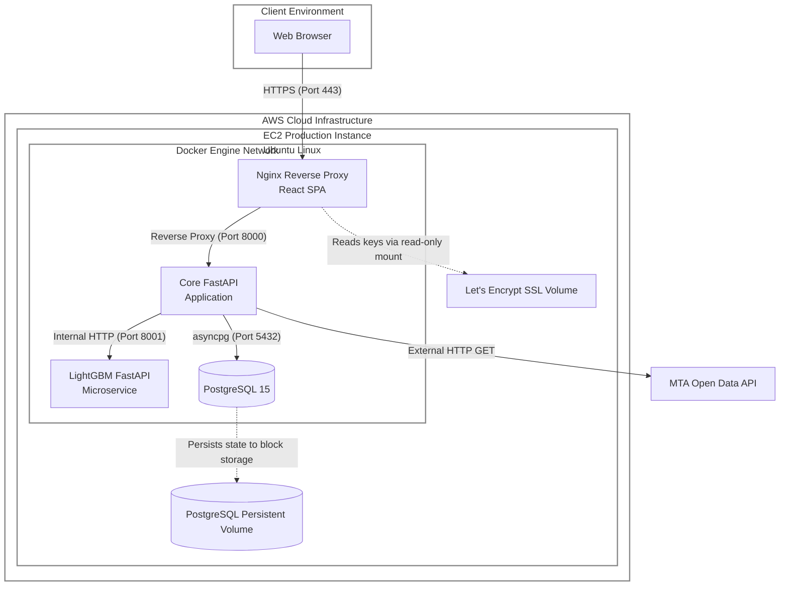

# 12. Deployment Architecture

## 12.1 Physical Deployment Architecture Diagram

The physical deployment architecture for the OnTime transit application leverages a single-node cloud deployment model hosted on Amazon Web Services (AWS). It utilizes Docker containerization to orchestrate the internal microservices, database engine, and frontend web server securely within an isolated virtual network bridge.

### 12.1.1 Deployment Node Descriptions

**1. AWS EC2 Production Instance (Ubuntu Linux)**
*   **Role:** The primary physical execution environment (Virtual Machine). It provides the underlying compute logic, network security groups, and memory required to host the platform.
*   **Persistent Storage:** Maintains physical block storage (`ontime_postgres_prod_data`) to ensure relational data outlives container lifecycles, and maintains local Let's Encrypt SSL certificates.

**2. Docker Engine (Container Orchestration)**
*   **Role:** Acts as the virtualized execution layer isolating dependencies. It wraps the application logic into four independent nodes (`db`, `backend`, `ml_service`, `frontend`), bridging them internally so they can communicate without exposing the database or internal APIs to the public web.

**3. Client Environment**
*   **Role:** The end-user physical node. It downloads the compiled React application (HTML/JS/CSS) and Mapbox GL geometries over a secure HTTPS connection, rendering the user interface locally on their device processors.

**4. MTA Open Data API**
*   **Role:** The external third-party infrastructure node providing real-time GTFS transit feeds to the backend system.
